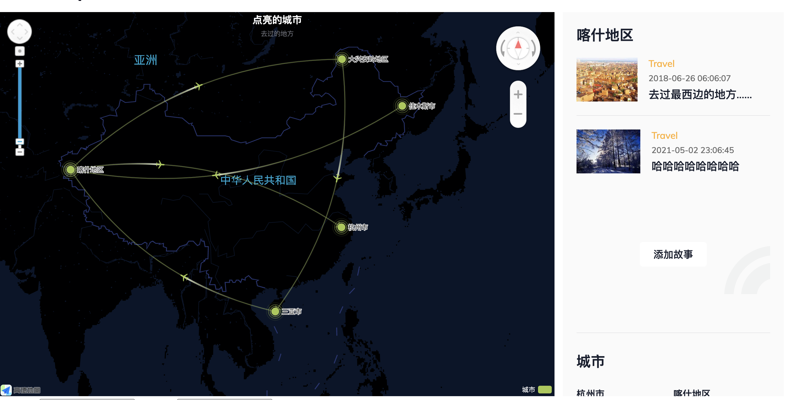
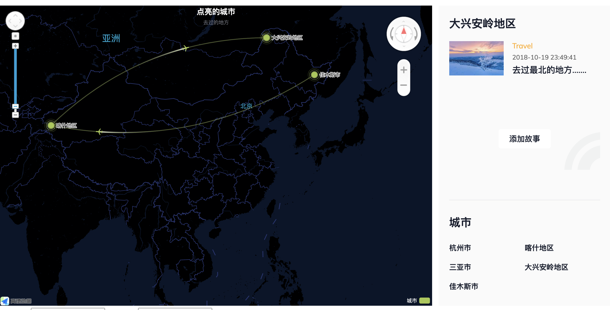
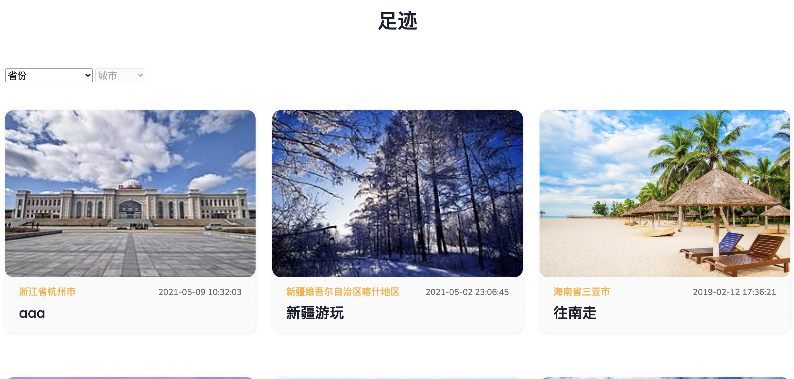

# 1.项目展示

## 日志轨迹



## 日志预览

## 

## 日志详情



# 2.需要配置的内容配置：

## Application中

mysql、redis、fastdfs

## 前端页面

static/map/map.html中修改高德地图的开发者key

```javascript
<script src="https://webapi.amap.com/maps?v=1.4.8&key=xxx&plugin=AMap.ControlBar"></script>
```

